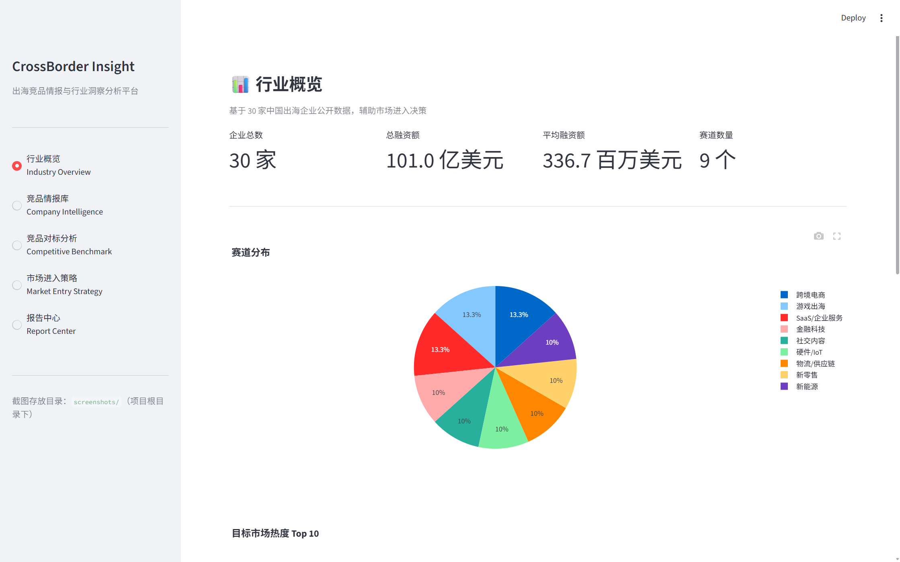
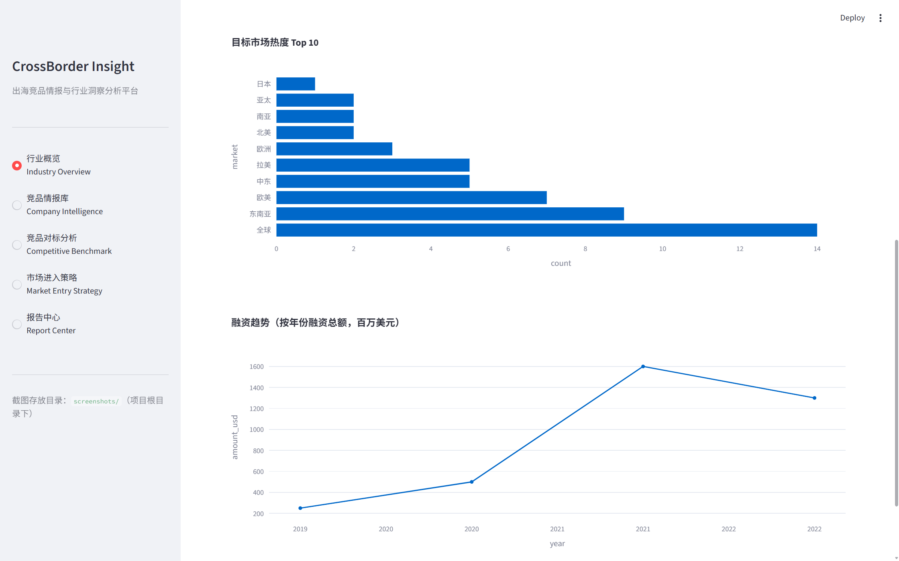
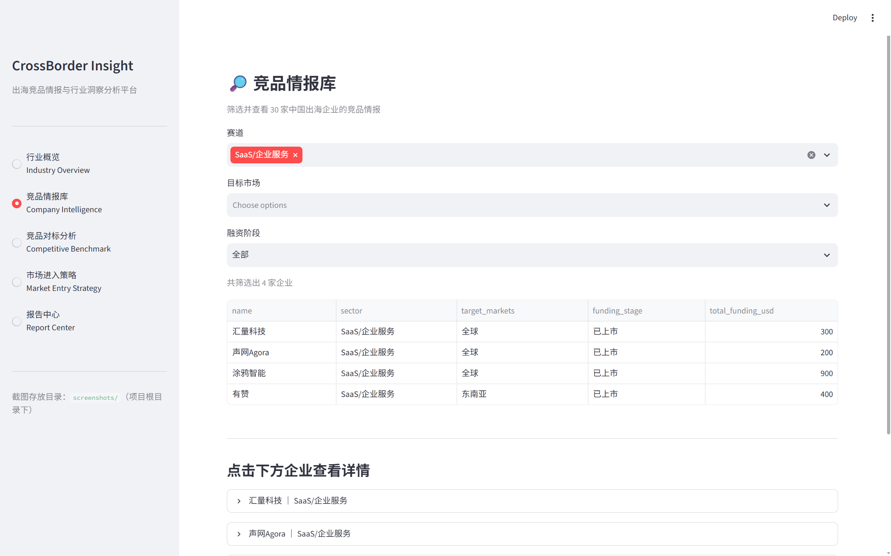
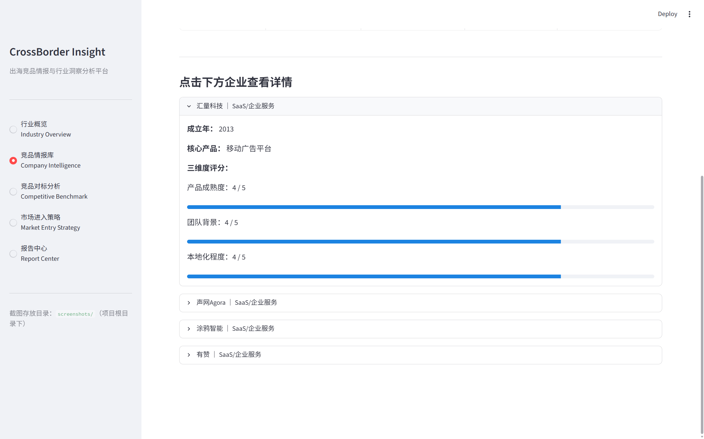
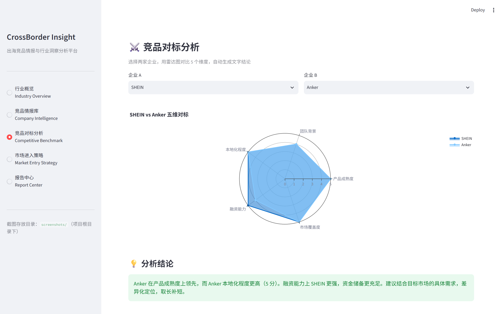
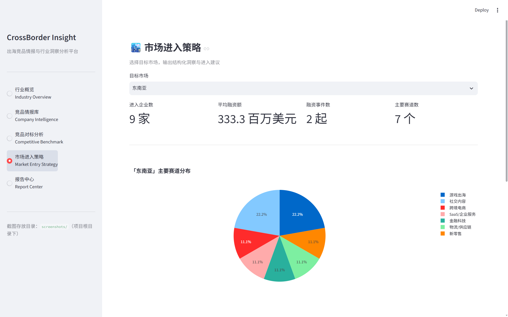
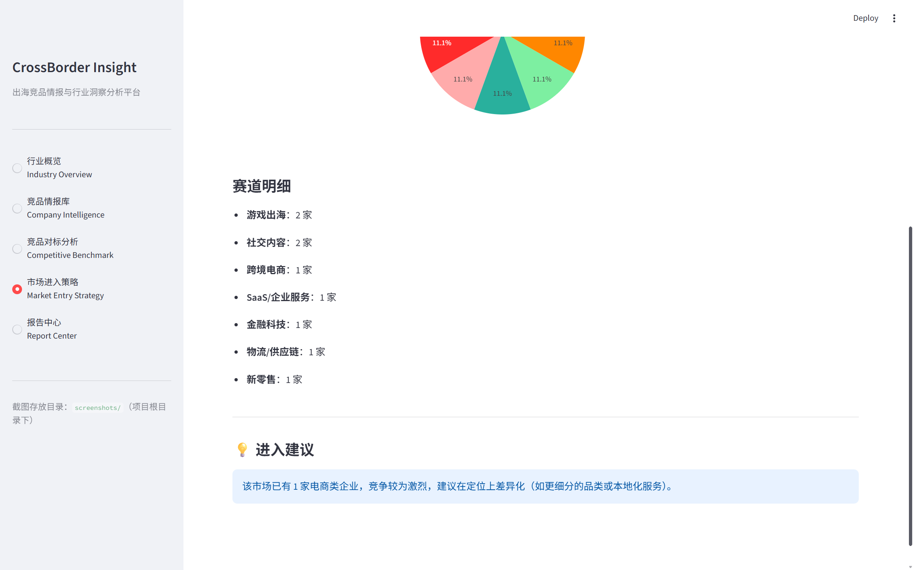
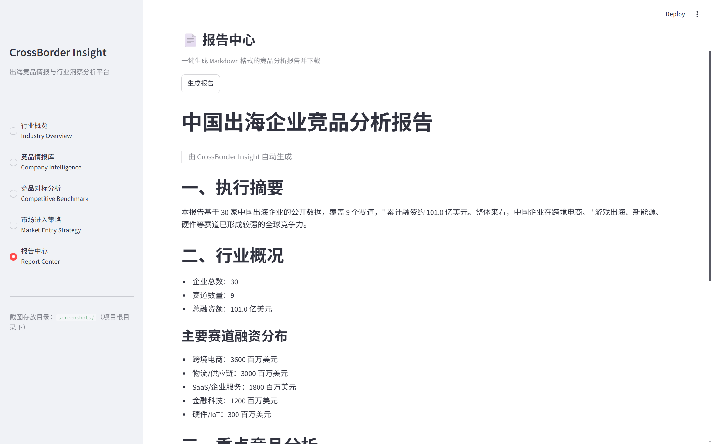
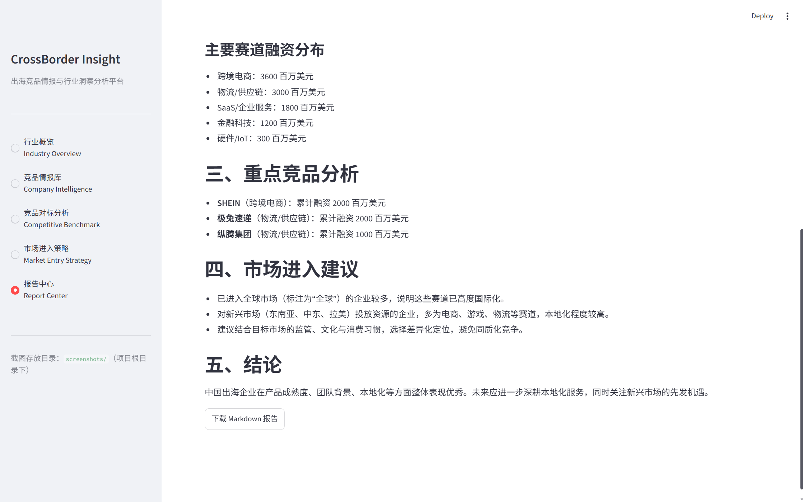
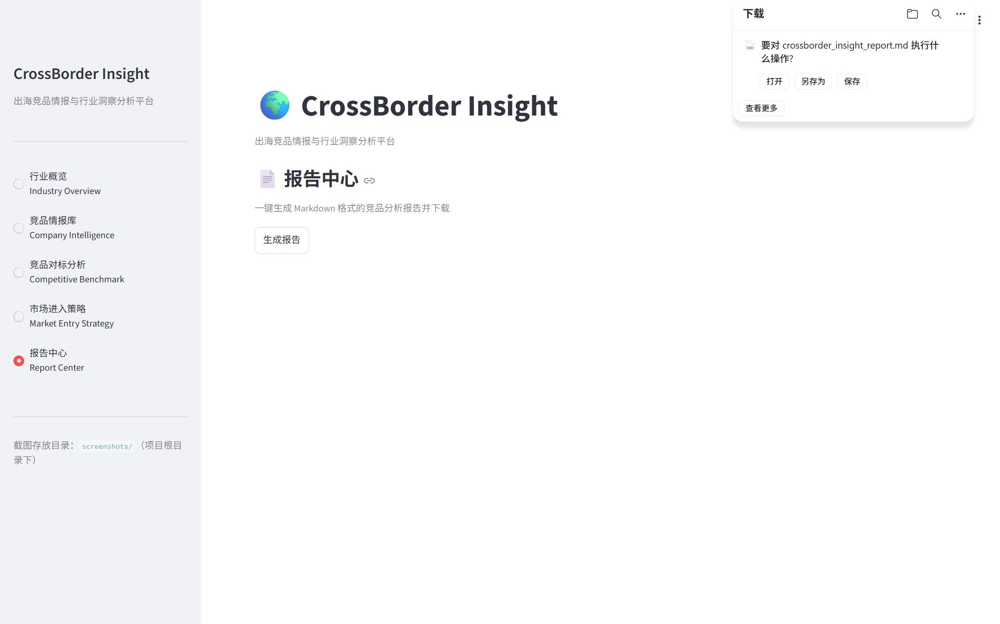

# 🌍 CrossBorder Insight

**出海竞品情报与行业洞察分析平台**

基于 **30 家中国出海企业** 的公开数据，面向"出海咨询"场景，提供行业概览、竞品情报库、竞品对标分析、市场进入策略与报告生成五大功能模块。

---

## 📌 项目介绍

CrossBorder Insight 是一个使用 **Streamlit** 构建的轻量级数据分析 Web 应用，帮助创业者、研究员与出海从业者快速洞察。
其功能有：

- 中国出海企业的整体行业分布与融资趋势
- 重点竞品的企业画像与多维评分
- 两家企业的五维对标（产品成熟度 / 团队背景 / 本地化 / 融资能力 / 市场覆盖度）
- 目标市场（东南亚 / 中东 / 欧美 / 拉美 / 非洲 / 日韩 / 南亚）的进入策略建议
- 一键生成并下载 Markdown 格式的竞品分析报告

---

## 🖼️ 功能截图

### 1. 行业概览 



### 2. 竞品情报库



### 3. 竞品对标分析


### 4. 市场进入策略



### 5. 报告中心




---

## 🚀 安装与运行

### 环境要求

- Python 3.8+

### 安装依赖

```bash
pip install streamlit pandas plotly openpyxl
```

### 启动应用

```bash
streamlit run app.py
```

启动后会在浏览器地址栏打开类似 `http://localhost:8501` 的页面。

---

## 🧰 技术栈

| 技术 | 用途 |
| --- | --- |
| [Streamlit](https://streamlit.io/) | UI 框架，快速搭建 Web 应用 |
| [Pandas](https://pandas.pydata.org/) | 数据处理与筛选 |
| [Plotly](https://plotly.com/python/) | 交互式图表（饼图 / 柱状图 / 折线图 / 雷达图） |
| SQLite | Python 内置数据库（本项目自包含数据，可直接替换为 SQLite 读取） |

---

## 📂 项目结构

```
.
├── app.py              # 主程序（含全部数据与逻辑）
├── README.md           # 项目说明
└── screenshots/        # 功能截图文件夹（自行添加）
```

---

## 📊 数据来源说明

- 项目内置的 **30 家中国出海企业** 数据，来自IT桔子、36氪出海、各企业公开披露信息（官网、招股说明书、公开融资新闻、行业研究报告等），仅用于学习与演示。
- 各数值为演示用途的近似值，**不构成任何投资建议**。

---

## 🔧 常见问题

**Q：运行报错 `streamlit: command not found`？**\
A：请确认已执行 `pip install streamlit`，并确保 Python 环境正确激活。

**Q：图表不显示？**\
A：请确认已安装 `plotly`，并确保使用 `st.plotly_chart(fig)` 渲染图表。

**Q：如何修改数据？**\
A：直接编辑 `app.py` 顶部的 `companies_raw` 与 `funding_rounds` 列表即可。

---

> ⚠️ 免责声明：本项目数据与结论仅供学习与研究使用，不构成投资建议；请结合官方公开信息独立判断。